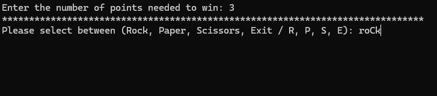
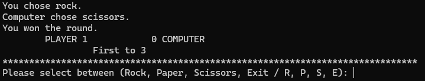
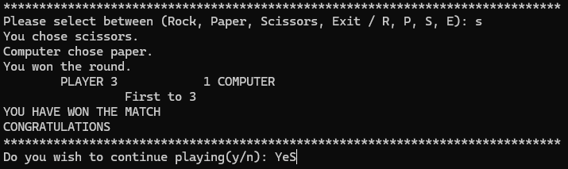

# Rock Paper Scissors

A console-based Rock Paper Scissors game written in C++.

---

## Features

- 🎮 Classic Rock, Paper, Scissors gameplay
- ✅ Robust input validation
- 🔤 Case-insensitive commands
- 🏆 Live score tracking
- 🔁 Replay support
- 📁 Written as a modular C++ project using multiple functions

---

# Gameplay Preview

## Starting a Match

At the beginning of every match, the player selects how many points are required to win. The game validates the input before starting the first round.



---

## Input Validation

The game rejects invalid inputs and prompts the player to try again. Inputs are also case-insensitive, allowing entries such as `Rock`, `ROCK`, or `rock`.


---

## Gameplay and Score Tracking

Each round displays both the player's and the computer's choices, announces the winner of the round, and updates the scoreboard until one side reaches the required number of points.



---

## Match Complete

Once the required score has been reached, the game announces the winner and allows the player to immediately start another match without restarting the program.



---

# Project Structure

```text
cpp-rock-paper-scissors/
│
├── screenshots/
│   ├── start.png
│   ├── input validation.png
│   ├── stats.png
│   └── victory.png
│
├── src/
│   └── main.cpp
│
├── README.md
├── LICENSE
└── .gitignore
```

---

# Building

Compile with g++:

```bash
g++ src/main.cpp -o RockPaperScissors
```

Run the executable:

### Windows

```bash
RockPaperScissors.exe
```

### Linux/macOS

```bash
./RockPaperScissors
```

---

# What I Learned

This project gave me hands-on experience with:

- Function decomposition
- Input validation
- References (`&`)
- Range-based for loops (for each)
- Switch statements
- Clean code organization

---

# Future Improvements

- Colored console output
- Match statistics
- Split the project into multiple source and header files

---

# License

This project is licensed under the MIT License.
